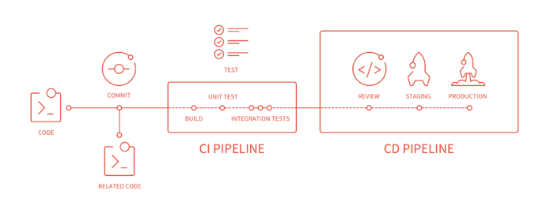

# GitLab介绍

GitLab 是一个Git服务器，一个数据库支持的 web 应用.可以通过虚拟机或docker来安装gitlab服务器。

从 [https://bitnami.com/stack/gitlab](https://bitnami.com/stack/gitlab) 获取一键安装包,[bitnami使用指南](https://docs.bitnami.com/virtual-machine/apps/gitlab/)。

也可以使用docker,参照：[https://hub.docker.com/r/gitlab/gitlab-ce/](https://hub.docker.com/r/gitlab/gitlab-ce/)

#### 钩子 {#_钩子}

GitLab 在项目和系统级别上都支持钩子程序。 对任意级别，当有相关事件发生时，GitLab 的服务器会执行一个包含描述性 JSON 数据的 HTTP 请求。 这是自动化连接你的 git 版本库和 GitLab 实例到其他的开发工具，比如 CI 服务器，聊天室，或者部署工具的一个极好方法。

[如何跟别人解释Gitlab？](https://about.gitlab.com/2016/11/30/how-to-explain-gitlab-to-anyone/)

GitLab CI\(持续集成\)服务是GitLab的一部分，它管理项目和用户界面，允许对每次提交进行单元测试，并在构建失败时发出警告信息。

## 理解Runner

GitLab Runner其实是一个开源项目，可以理解为作业执行器。用于运行作业并将结果发回GitLab。它与GitLab CI一起使用，GitLab CI是与协调工作的GitLab一起提供的持续集成服务。

### Runner的特性

运行规则：

- 多任务并行执行
- 使用不同的token和不同的gitlab服务器或项目链接
- 每个token的并行任务有限

Job执行方式：

- 本地
- 使用Docker容器
- 使用Docker containers 并通过ssh
- 使用Docker容器，在不同的云和虚拟化管理程序上进行自动缩放
- 连接到远程SSH服务器
- 是用Go编写并以单个二进制文件的形式发布，而没有任何其他要求吗
- 支持Bash, Windows批处理和Windows PowerShell
- 在GNU/Linux、OS X和Windows上工作(几乎在你能运行Docker的任何地方)
- 允许定制作业运行环境
- 自动配置重新加载，无需重新启动
- 易于使用的设置，支持Docker, Docker-SSH, Parallels或SSH运行环境
- 可以利用Docker容器的缓存
- 易于安装作为一个服务GNU/Linux, OSX和Windows
- 嵌入式Prometheus规格HTTP服务器

### 安装GitLab Runner方式

- [Install using GitLab's repository for Debian/Ubuntu/CentOS/RedHat (preferred)](https://docs.gitlab.com/runner/install/linux-repository.html)
- [Install on GNU/Linux manually (advanced)](https://docs.gitlab.com/runner/install/linux-manually.html)
- [Install on macOS](https://docs.gitlab.com/runner/install/osx.html)
- [Install on Windows](https://docs.gitlab.com/runner/install/windows.html)
- [Install as a Docker service](https://docs.gitlab.com/runner/install/docker.html)
- [Install in autoscaling mode using Docker machine](https://docs.gitlab.com/runner/executors/docker_machine.html)
- [Install on FreeBSD](https://docs.gitlab.com/runner/install/freebsd.html)
- [Install on Kubernetes](https://docs.gitlab.com/runner/install/kubernetes.html)
- [Install the nightly binary manually (development)](https://docs.gitlab.com/runner/install/bleeding-edge.html)

在gitlab ci中，runners执行代码的方式由.gitlab-ci.yml来决定,.gitlab-ci.yml相当于一个runner的指导手册,runner根据这个文件来进行CI。总的步骤就是在仓库根目录创建一个名为.gitlab-ci.yml 的文件，为该项目配置一个Runner，完成上面的步骤后，每次push代码到Git仓库， Runner就会自动开始pipeline。

### Runner 做了什么

首先要触发ci/cd需要在项目根目录创建gitlab-ci.ym文件,.gitlab-ci.yml文件定义了CI/CD的pipeline有哪些stages,并且每个阶段需要执行的job。最基础的stage有build,test,deploy,每个阶段可以定义多个job,

当代码提交时,触发CI/CD,GitLab Runner克隆了这个项目，runner将根据GitLab-CI的命令运行。GitLab runner实际上是Golang语言执行一系列已经预设好的命令。

### Runner被安装在哪里

可以按照前面所讲的安装方式,选择想要安装的环境,也可以直接使用gitlab已经安装好的,提供给你的shared runner。

### Runner如何运行脚本

一个运行器可以有多个执行器，如docker、shell、virtualbox等，但docker是最常见的。如果您使用docker作为执行程序，您可以从docker hub或您配置的注册仓库中提取任何映。在docker环境中，通常以根用户的身份运行它们。

参考：

[Gitlab 8.x runner安装与配置](http://muchstudy.com/2018/07/13/Gitlab-8-x-runner%E5%AE%89%E8%A3%85%E4%B8%8E%E9%85%8D%E7%BD%AE/)

## GitLab CI/CD Variables的一些参数

当接受到GitLab CI的job时，runner开始准备构建环境。它会设置一个预定义变量列表(环境变量)和一个用户定义变量列表。而这些变量可能会互相覆盖,需要注意它们之间的优先级。

优先级如下

- Trigger(触发) variables or scheduled pipeline variables (take precedence over all)
- Project-level variables or protected variables
- Group-level variables or protected variables
- YAML-defined job-level variables
- YAML-defined global variables
- Deployment variables
- Predefined variables (are the lowest in the chain)

